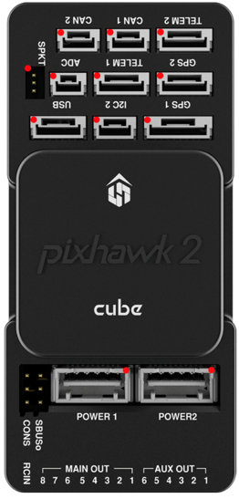

# Cube Information

Basic information about the cube. Say what each in/out does and how to do the initial plug in setup.

The cube is a very expensive research grade flight computer so please don’t blow it up. 

[Cube User Manual](https://docs.cubepilot.org/user-guides/autopilot/the-cube-user-manual)

[Servo Movement documentation](https://ardupilot.org/dev/docs/mavlink-move-servo.html)

[MAVLink common messages](https://mavlink.io/en/messages/common.html)

## Requirements

Year on year the requirements may vary but the basic bits stay the same. Make sure the check the Design Specification and Deliverables documents for specifics.

The student-built avionics should be able to:

- Move the control surfaces
- Talk to the cube via Wifi
- Talk to the cube via Radio
- Log the generated data
- Sense flap angle
- Sense pressure
- Switch between cube modes and arming states

## Cube Setup

Plug this here and this there