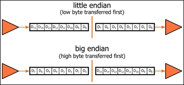

# I2C & LUA

Ardupilot specific LUA documentation: [LUA docs](https://github.com/ArduPilot/ardupilot/blob/master/libraries/AP_Scripting/docs/docs.lua)

Ardupilot scripting support page: [Common LUA scripts](https://ardupilot.org/copter/docs/common-lua-scripts.html)

I2C documentation: [I2C-bus specification and user manual](https://www.nxp.com/docs/en/user-guide/UM10204.pdf)

This part of the document will provide basic information on how to set up I2C from both the hardware (wiring) and software side (through LUA scripts; see example code for further help).

## Wiring of the I2C bus

An I2C serial bus uses two wires (not counting VCC and neutral): SCL – clock & SDA – data. Being a multi-master/multi-slave, half-duplex protocol, multiple controllers and devices can be connected to the same bus, but only one can transmit at a time.

The wiring of the serial bus itself is straightforward: connect the SCL line to the SCL pins and the SDA line to the SDA pins of all devices on the bus, as seen in Figure 1. **It is very important, however, that both the SDA and SCL lines require pull-up resistors**S connected to the logical high voltage of the selected microcontroller that will pull the line high when needed. There is a complex way of sizing the resistance of these resistors with high and low resistances both having pros and cons, but generally 4.7 kΩ is perfectly suitable for this kind of application. 

If the Cube is directly used as the master, then there is no need for dedicated external pull-up resistors as there are built-in ones in the flight controller.


Mock-up of an I2C serial bus

## Enabling scirpting on the CubePilot

Before LUA scripts can be executed onboard the flight controller, the scripting feature must be enabled using the parameters of the Cube. Using Mission Planner (or any other similar GS program), locate the `SCR_ENABLE` parameter and set it to `1` before rebooting the Cube. A new folder should appear in the `APM` folder named `scripts`; if it doesn’t, it needs to be manually created.

After this is done, any LUA code uploaded into this folder will be automatically executed when the Cube powered on.

## Setting up and using I2C with LUA scripts

This part tries to explain the basic process of setting up and reading data from an I2C bus. To help understanding, example codes are provided.

The first thing that must be done when working with I2C is to take note of the address of the device that is to be used. To set up a device on the I2C bus, LUA’s built-in i2c: module is used. For example, the following line 
```lua
local sensor = i2c:get_device(bus, ADDR)
```
will create a variable named sensor as an I2C device on bus `bus` (most likely will be `0` on the Cube) and with I2C address `ADDR`.

To read data from a specific register from a device the `<device_var>:read_registers(REG, <int>)` syntax can be used. With the above example:
```lua
sensor:read_registers(REG, 2)
```
will read two bytes of data, starting from sensor’s register with address `REG`.

The data read from the registers will come in the shape of an array of bites and need to be broken up into separate binary integers. This is done differently depending on the device’s endianness which must be found from the documentation. Figure 2 helps show the difference between little- and big-endian systems. This only changes the order of the bites transferred but must accounted for to get the data accurately.



Endianness in a two-byte system

The example code will showcase the basic bit operations that will help extract the data from the bit array the data was transmitted in in both big- and little-endian systems. 