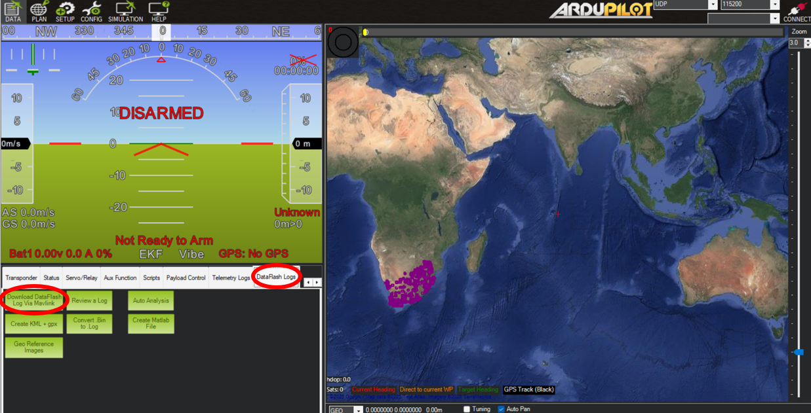

# Data Logging

## Downloading Cube logs {#downloading-cube-logs}

The flight controller automatically creates a log of all its sensors (IMUs, temp. sensors, etc.) and its attitude changes during operation into a .bin file. These are necessary to analyse the behaviour of the drone in the wind tunnel and should be downloaded after each test so that the appropriate subteams of the Company can use their data.

!!! warning "The cube must be armed in order to log data"

The data in stored in .bin files. The easiest way to access these files is pulling them directly off of the SD card.

These logs can also be accessed through Mission Planner by clicking the `Download DataFlash Log Via Mavlink` button in the `DataFlash Logs` panel.

!!! tip "You can also view a selected .bin file directly with the `Review a Log` button"

This open up the `Log Downloader` menu, showing all avaible log files which you can download from here.

!!! warning "The download is quite slow over usb connection and extremely slow over Wifi"

## Optional: Logging through LUA scripts

LUA scripts can create and modify files on the Cube’s memory; therefore, it is possible to create logs using LUA scripts (i.e. saving flap angles from the sensor into a CSV). This should only be done for a few sensors only, as it requires a lot of processing power from the flight controller. The example scripts will showcase this as well.

## MatLab data analysis

A useful tool to analyse the Cube logs is the `Flight Log Analyser` app built into MatLab.

To access the app you first need to download MatLab's `UAV Toolbox` extension from the Add-on Explorer.

After opening the `Flight Lob Analyser` app. Click import to import your .bin file previosuly downloaded using a method from [Downloading Cube logs](Data-Logging.md#downloading-cube-logs).

!!! note "It may take a while for large .bin files to load"

The next step is is adding the desired signals you want to analyse. This is done by clicking the `Add Custom Signal` button. This will open the `Add Custom Signal` menu with a list of all the signals that the cube logged. 

!!! tip "The most relevant signal is `ATT`"
    This stands for "Attitude" which will give you the pitch/roll/yaw and other relevant data. 

    Make sure to inclue the `TimeUS` signal since this will give you timestamps.

Once you've selected your signals, click `Add Signals` and they'll appear in the `Signal Preview` box. 

!!! note "You must name your signal before it lets you click `OK`"

!!! tip "Feel free to explore the other available signals"
    Lots of cool post-processing can be done!

Next click the `Add Figure` button to create a Figure. In the `PLOTS` dropdown menu, the `XY` custom plot is the most useful. Click on it to create a plot.

Finally, to plot signals into your figure, click the `Add Signal` button. A new line should appear. Double clicking on either the X or Y axis box in the table will open up the `Signal Browser` menu where you can select one of your previously added custom signals.

The image below shows the final result of the Pitch and Desired Pitch vs Time for a Fuselage test switching between the Cube's `Manual` and `Stabilize` mode and messing with the PD variables.

