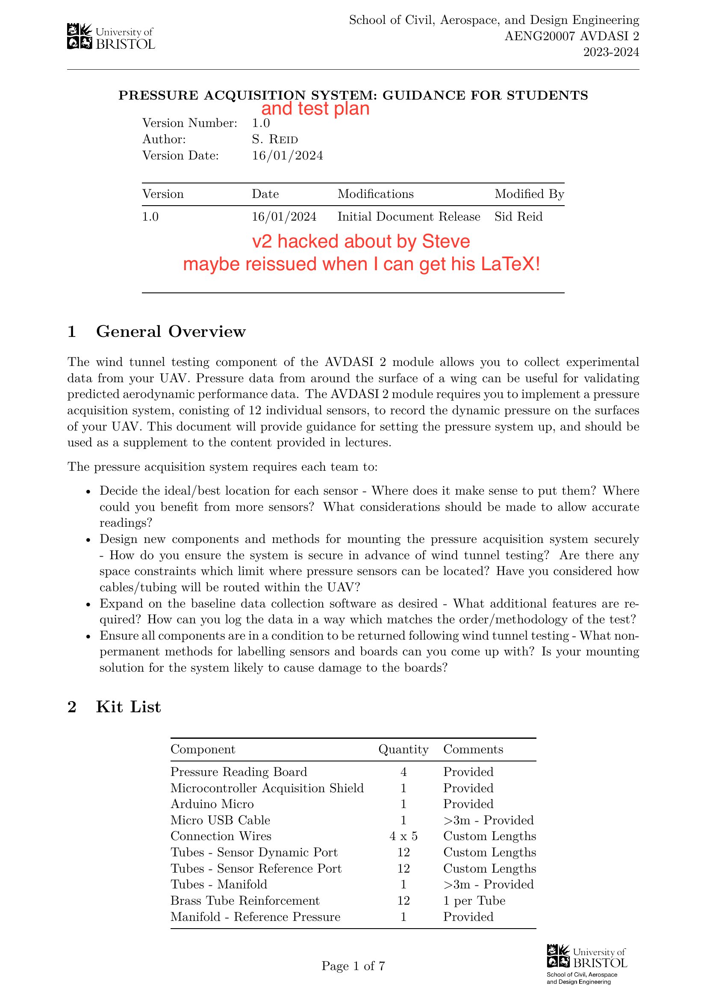
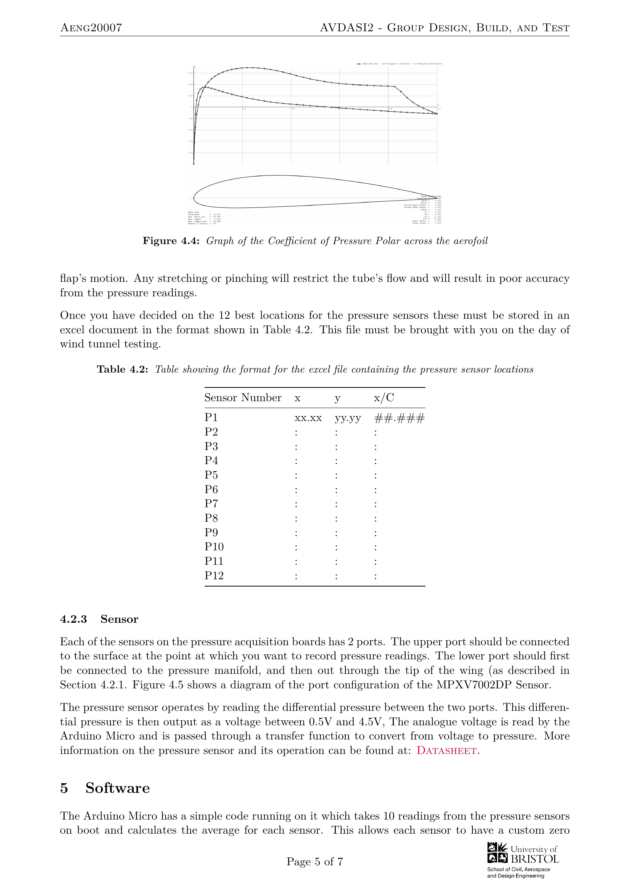

# Page 1

School of Civil, Aerospace, and Design Engineering
AENG20007 AVDASI 2
2023-2024
PRESSURE ACQUISITION SYSTEM: GUIDANCE FOR STUDENTS
Version Number:
1.0
Author:
S. Reid
Version Date:
16/01/2024
Version
Date
Modifications
Modified By
1.0
16/01/2024
Initial Document Release
Sid Reid
1
General Overview
The wind tunnel testing component of the AVDASI 2 module allows you to collect experimental
data from your UAV. Pressure data from around the surface of a wing can be useful for validating
predicted aerodynamic performance data. The AVDASI 2 module requires you to implement a pressure
acquisition system, conisting of 12 individual sensors, to record the dynamic pressure on the surfaces
of your UAV. This document will provide guidance for setting the pressure system up, and should be
used as a supplement to the content provided in lectures.
The pressure acquisition system requires each team to:
• Decide the ideal/best location for each sensor - Where does it make sense to put them? Where
could you benefit from more sensors? What considerations should be made to allow accurate
readings?
• Design new components and methods for mounting the pressure acquisition system securely
- How do you ensure the system is secure in advance of wind tunnel testing? Are there any
space constraints which limit where pressure sensors can be located? Have you considered how
cables/tubing will be routed within the UAV?
• Expand on the baseline data collection software as desired - What additional features are re-
quired? How can you log the data in a way which matches the order/methodology of the test?
• Ensure all components are in a condition to be returned following wind tunnel testing - What non-
permanent methods for labelling sensors and boards can you come up with? Is your mounting
solution for the system likely to cause damage to the boards?
2
Kit List
Component
Quantity
Comments
Pressure Reading Board
4
Provided
Microcontroller Acquisition Shield
1
Provided
Arduino Micro
1
Provided
Micro USB Cable
1
>3m - Provided
Connection Wires
4 x 5
Custom Lengths
Tubes - Sensor Dynamic Port
12
Custom Lengths
Tubes - Sensor Reference Port
12
Custom Lengths
Tubes - Manifold
1
>3m - Provided
Brass Tube Reinforcement
12
1 per Tube
Manifold - Reference Pressure
1
Provided
Page 1 of 7
and test plan
v2 hacked about by Steve
maybe reissued when I can get his LaTeX!

# Page 2

Aeng20007
AVDASI2 - Group Design, Build, and Test
3
System Overview
The AVDASI 2 pressure acquisition system is a bespoke system consisting of 4 sensor boards, each
board has 3 pressure differential readings (total of 12 pressure differential readings), 1 microcontroller
shield board, and an Arduino Micro microcontroller.
This system uses the Arduino Micro to log the analogue readings from each pressure sensor and
interfaces with a MATLAB-based UI for data collection and processing. The data is logged at 50Hz
and is processed from raw analogue voltage readings to pressure readings (in Pascals) within the
MATLAB script.
Pressure Acquisition Board
Pressure 
Sensor
Pressure 
Sensor
Pressure 
Sensor
Screw Terminal Block
To:
Reference
Manifold
From:
Surface
Points
Main Shield
Screw Terminal Block
Screw Terminal Block
Screw Terminal Block
Screw Terminal Block
POWER & DATA Connection
USB to PC
X 4
Figure 3.1: Diagram showing an overview of the AVDASI 2 pressure system
Figure 3.1 shows an overview of the entire pressure acquisition system. The 12 Pressure sensors have
a total of 24 input ports for silicone tubing. 12 should be connected to their respective sensing points
on the surface and 12 are attached to the pressure manifold. This manifold has a single output which
must be connected to a long ”exit tube”.
4
Connections Required
4.1
Electrical Connections
Each of the pressure reading boards has a screw terminal block capable of connecting 5 wires. The
configuration of these blocks is the same for every one of the boards. When looking at the in-port side
of the block, the pinout is: [P1] [P2] [P3] [5V] [GND]. The MPXV7002DP Pressure Sensors are labelled
similarly. Each of these ports must be connected to the corresponding port on the Microcontroller
shield, as shown in Table 4.1. Only one connection in each port is required for each board.
Table 4.1: Showing connections between pressure reading board and microcontroller shield.
Pressure Reading Board
Microcontroller Shield
P1
P1, P4, P7, P10
P2
P2, P5, P8, P11
P3
P3, P6, P9, P12
5V
5V
GND
GND
The microcontroller shield then connects to the Arduino Micro, using pins A0 to A11 to read all 12
analogue inputs. There is a green LED next to each pressure sensor indicating that the sensor is
Page 2 of 7

# Page 3

Aeng20007
AVDASI2 - Group Design, Build, and Test
powered correctly. The Arduino micro should be connected to the shield such that the usb port aligns
with the box at the top of the rectangular footprint on the PCB.
4.1.1
Troubleshooting
When troubleshooting the connections to the board it is recommended to first use a multi-meter to
perform a ”continuity check” between each of the boards. To do this use the probes of the multi-meter
on the screw heads in the terminal blocks. This check will allow the simplest issues to be ruled out
before seeking help from a Postgraduate or Staff member. There are some spare boards available but
these will be used on a first-come-first-served basis.
4.2
Pressure Connections
The pressure connections in the AVDASI pressure acquisition system are all designed for use with 2mm
Inner Diameter silicone tubing. The MPXV7002DP sensor has two ports, the upper port measures
the dynamic pressure and the lower port should be connected to the reference pressure. The sensor
records the difference in pressure between the dynamic and reference pressure and outputs this as an
analogue voltage.
4.2.1
Manifold
The 12-to-1 pressure manifold is the first pressure connection to consider within the wing and fuselage.
Setup of this manifold involves connecting the 12 reference pressure ports on each pressure sensor to
an input of the manifold. The pressure manifold must be airtight to avoid fluctuations in the reference
pressure reading caused by the wind tunnel. Figure 4.1 shows the 12 input ports and the single output
port of the manifold.
12 x Ø 4mm
19
Ø6
4
33
76
2.5
30
Figure 4.1: Figure showing a dimensioned drawing of the reference pressure manifold
The single output port must be connected to a silicone tube with an overall length greater than 3m.
This output tube must then be routed through the tip of the wing, or the back of the fuselage pod.
To ensure that the pressure manifold remains airtight it has been covered with epoxy resin. The
tubes you add to the inputs should therefore also be epoxied in place. To test whether the pressure
Page 3 of 7

# Page 4

Aeng20007
AVDASI2 - Group Design, Build, and Test
manifold is airtight, it is advised to submerged the manifold in water (with all of the tube ends above
the surface) and check for bubbles. The presence of bubbles indicates that the manifold is not airtight
- and thus needs to have more epoxy resin applied.
4.2.2
Wing Surface
As explained in the Week 14 wind tunnel lecture (2 of 2), any bumps or excessive surface roughness
will have a significant impact on the boundary layer development on both the wings and fuselage,
which will ultimately influence the surface pressure data and your pressure distribution. Thus, it is
critical that the pressure sensor inlet is flush with the surface. To help you achieve this, we will provide
brass tube inserts (see Figs. 4.2 and 4.3) that are to be slotted within the tubes.
Figure 4.2: Figure showing an example of how the surface should be finished using the brass tube inserts
Ø4
Ø2
14
0.2
0.2
R0.8
Figure 4.3: Figure showing the dimesnions of the brass tube inserts
Precise positioning of the sensor locations on the surface of the wing and fuselage is essential for
producing a complete profile of the pressures over the entire surface. For this reason, determining the
best/most interesting flow locations is necessary. This section will primarily repeat the information
given in the lecture slides.
For measuring the pressure distribution over an aerofoil equispaced and symmetrical configurations of
pressure sensors will not give the best coverage or description of the flow field. To achieve the best
coverage using the pressure sensors, the rate of change of surface gradient should be considered. So
that sufaces with the highest rate of change have the largest number of sensors.
XFLR5 and XFOIL can also be used to help determine the best pressure sensor locations. Figure 4.4
shows a plot of the coefficient of pressure across the surface of an aerofoil. It is important when
considering the optimum locations to consider this distribution. A higher number of sensors should
be placed around areas of the polar with the greatest change observable.
You may find that you want to put at least one sensor in flap of your wing. In this case you must
consider how to prevent the tube connecting to the surface from stretching or being pinch during the
Page 4 of 7

# Page 5

Aeng20007
AVDASI2 - Group Design, Build, and Test
Figure 4.4: Graph of the Coefficient of Pressure Polar across the aerofoil
flap’s motion. Any stretching or pinching will restrict the tube’s flow and will result in poor accuracy
from the pressure readings.
Once you have decided on the 12 best locations for the pressure sensors these must be stored in an
excel document in the format shown in Table 4.2. This file must be brought with you on the day of
wind tunnel testing.
Table 4.2: Table showing the format for the excel file containing the pressure sensor locations
Sensor Number
x
y
x/C
P1
xx.xx
yy.yy
##.###
P2
:
:
:
P3
:
:
:
P4
:
:
:
P5
:
:
:
P6
:
:
:
P7
:
:
:
P8
:
:
:
P9
:
:
:
P10
:
:
:
P11
:
:
:
P12
:
:
:
4.2.3
Sensor
Each of the sensors on the pressure acquisition boards has 2 ports. The upper port should be connected
to the surface at the point at which you want to record pressure readings. The lower port should first
be connected to the pressure manifold, and then out through the tip of the wing (as described in
Section 4.2.1. Figure 4.5 shows a diagram of the port configuration of the MPXV7002DP Sensor.
The pressure sensor operates by reading the differential pressure between the two ports. This differen-
tial pressure is then output as a voltage between 0.5V and 4.5V, The analogue voltage is read by the
Arduino Micro and is passed through a transfer function to convert from voltage to pressure. More
information on the pressure sensor and its operation can be found at: Datasheet.
5
Software
The Arduino Micro has a simple code running on it which takes 10 readings from the pressure sensors
on boot and calculates the average for each sensor. This allows each sensor to have a custom zero
Page 5 of 7

# Page 6

Aeng20007
AVDASI2 - Group Design, Build, and Test
Dynamic Pressure
Input
Reference Pressure
Input
Figure 4.5: Illustration of the port configuration of the MPXV7002DP sensor (looking directly at the
side with ports)
offset. The code then takes a reading from each sensor in turn at a rate of 50Hz. These are output to
the MATLAB app. The app is shown in Figure 5.1.
Figure 5.1: Screenshot of Version 1 of the MATLAB App
The MATLAB app then takes these readings and applies a transfer function to them, This converts
the analogue signal into a pressure reading in Pascals. The data is saved in a .CSV file and can be
processed to give the coefficient of pressure at each point on the surface of the wing. Any modifications
to the MATLAB app are welcome - however, these modifications must be tested fully prior to wind
tunnel testing, to ensure that there is no loss of experimental data.
6
Gate submission
The requirements for the gate submission document are as follows:
1. Complete Table 4.2.
2. Why did you chose these locations? Wing Teams: Did you focus on the wing pressure or suction
surface or both? POD/fuselage teams: Did you focus on the port or starboard surface or
both? Include in your explanations references to XFOIL-obtained or relevant published data
and material covered in the lecture slides. You may wish to include a diagram to support your
answers. (short paragraph)
3. Will any of the sensors be placed at different spanwise locations (for wing teams) or waterlines
(for fuselage/pod teams)? In any case, explain why, and refer back to the relevant lecture slides.
(maximum of two sentences).
4. What are any possible foreseeable issues with your sensor arrangement?
(maximum of two
sentences).
Page 6 of 7
Test Plan

# Page 7

Aeng20007
AVDASI2 - Group Design, Build, and Test
5. POD/fuselage teams: your experiments will be conducted at a single flow speed, U0, which
will be determined on the day of testing based on the structural resilience of the design with
increasing flow speed. During static tests, three yaw angles will be tested, being 0◦, 1◦and 2◦
and seven pitch angles (−10◦to +20◦in 5◦increments). Create a Test Matrix (as introduced
in Week 14 Lecture 2 of 2) to summarise this experimental regime. Note that the dynamic tests
will be dependent on the outcome of the static tests and you are not expected to develop a test
matrix for these cases.
6. Wing Teams: your experiments will be conducted at two flow speeds, U0,1 and U0,2; the
maximum value will be determined on the day of testing based on the structural resilience of
the design with increasing flow speed. Up to ten angles of attack will be tested, from 0◦to
approaching stall in no less than 1◦increments, at positive and negative angles of attack. In
each case, the flap will be tested in up, down and in neutral positions. The aileron will be tested
for maximum and minimum deflection for each case. Create a Test Matrix (as introduced in
Week 14 Lecture 2 of 2) to summarise this experimental regime.
7. Provide an estimate of the number of total experimental stages outlined. Discuss the overall
balance of total number of experimental stages, including whether each stage is necessary to
develop the experimentally required outputs (such as drag coefficient, etc). (maximum of three
sentences)
Page 7 of 7

