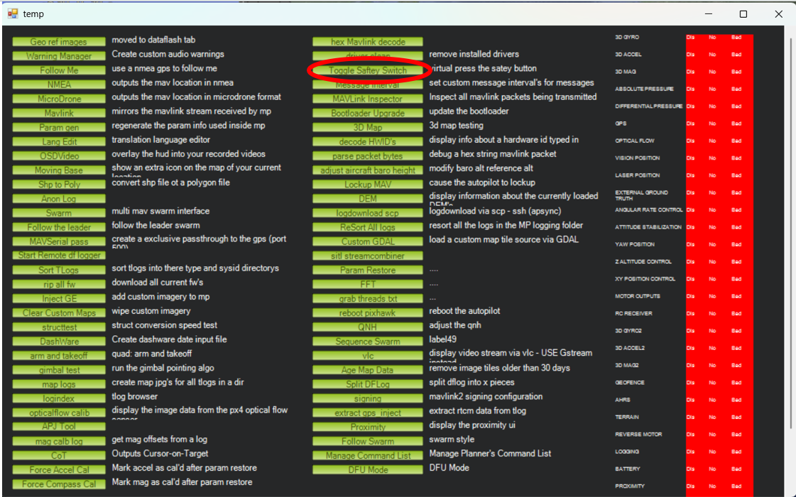

# Mission Planner

Mission planner is an open-source the software used to communicate and control the cube. Your code should replace Mission Planner and provide the same basic functionality. Mission planner is still useful to use for testing and has numerous vital features.

[Installation info (ardupilot.org)](https://ardupilot.org/planner/docs/mission-planner-installation.html)

[Mission Planner overview (ardupilot.org)](https://ardupilot.org/planner/docs/mission-planner-overview.html)

## Connecting

For this first stage we'll power the Cube from your computer's USB port.

!!! warning "A really important note on power"
    **Do not plug anything else into the Cube if you're just powering from USB**. Your laptop's USB port is limited in the current it can supply, and servos can draw significant current when stalled (more on this in later steps). In short, if you plug stuff in and do the wrong thing you can at best fry the Cube (putting your Team, Division, and Company's success at risk), and at worst fry your laptop (possibly putting your degree and life at risk - back things up, kids!).

Mission Planner can be connected to the Cube over Wifi and USB. If connecting through USB, <u>**make sure to use the buzzer**</u>; do not plug the cable directly into the Cube. In mission planner, on the top right of the window, you will see two selection boxes and a `Connect` button. If you know which `COM` terminal you plugged the USB into, select it, but there is an `AUTO` function too. 

!!! tip "Wait until the cube buzzes before clicking connect."

Image credit: Mission Planner

Using the Wifi module is a bit different but simple. After setting up the Wifi chip (for more information see [Wifi](Wifi.md)), connect the chip to the Cube’s `Telem1/Telem2` port and your computer to the Wifi network. Select the `UDP` setting and hit connect.

!!! tip "If not working, make sure you're still connected to the chip (and not Eduroam) and your GCS isn't connected to the cube"

## Parameters

When first connecting to the cube, there are a few parameters that need changing. In Mission Planner, a parameter is a configurable setting that tells the flight controller (like the Cube) how to behave. Parameters control everything from flight modes, sensor settings, failsafes, and PID tuning, to things like which servo does what and how fast a drone should climb or descend.

To access parameters, go to config and then full parameter list. This opens up every single parameters available for you to change. Scroll or search for `NFT_BUZZ_VOLUME` and turn it down so the cube doesn’t scream at you every time you turn it on. Then click `write params` and congratulations you’ve changed the cube settings. 

!!! info "Don’t forget to save your parameters every so often so you don’t lose them."

Uselful Parameters:

| Parameter           | Value     | Meaning                                                      |
|---------------------|-----------|--------------------------------------------------------------|
| `NTF_BUZZ_VOLUME`   | 1–5       | Sets buzzer volume level                                     |
| `ARMING_CHECK`      | 0         | Disables all arming checks                                   |
| `ARMING_REQUIRE`    | 0         | Disables requirement for arming                              |
| `THR_FAILSAFE`      | 2         | Enables throttle failsafe in **land** mode.                  |
| `FLIGHTMODE_CH`     | 5         | RC channel used to switch flight modes (usually RC5).        |
| `FLTMODE1`          | 0         | Flight mode 1 = Stabilize mode.                              |
| `FLTMODE6`          | 10        | Flight mode 6 = Auto mode.                                   |
| `RC6_OPTION`        | 4         | RC6 triggers Arm/Disarm.                                     |
| `RC7_OPTION`        | 31        | RC7 triggers `Mission Start`.                                |
| `RC8_OPTION`        | 208       | RC8 triggers `Relay Toggle` (custom or user-defined action). |
| `TERRAIN_FOLLOW`    | 0         | Terrain following disabled during missions.                  |
| `TERRAIN_ENABLE`    | 0         | Terrain data not used (no elevation mapping).                |
| `SERIAL1_PROTOCOL`  | 2         | MAVLink protocol enabled on SERIAL1.                         |
| `SERIAL1_BAUD`      | 921       | Baud rate set to 921600                                      |

Default Channel Order:

| Function  | Channel | Port  |
|-----------|---------|-------|
| Aileron   | 1       | Main  |
| Elevator  | 2       | Main  |
| Throttle  | 3       | Main  |
| Rudder    | 4       | Main  |

Flap Control:

| Parameter        | Value   | Meaning                                |
|------------------|---------|----------------------------------------|
| `SERVO5_OPTION`  | 0 / 2   | 0 = PyMAVLink control, 2 = RC Control  |
| `SERVO5_MAX`     | CALC    | Maximum PWM output for SERVO5.         |
| `SERVO5_MIN`     | CALC    | Minimum PWM output for SERVO5.         |
| `SERVO5_TRIM`    | CALC    | Neutral (center) PWM value for SERVO5. |

Aileron Control:

| Parameter        | Value | Meaning                                     |
|------------------|--------|--------------------------------------------|
| `SERVO1_OPTION`  | 4      | RC passthrough or assigned aileron output. |
| `SERVO1_MAX`     | CALC   | Maximum PWM signal.                        |
| `SERVO1_MIN`     | CALC   | Minimum PWM signal.                        |
| `SERVO1_TRIM`    | CALC   | Neutral PWM value.                         |

Elevator Control:

| Parameter        | Value    | Meaning                                     |
|------------------|----------|---------------------------------------------|
| `SERVO2_OPTION`  | 0 / 19   | 0 = PyMAVLink control, 19 = RC Control      |
| `SERVO2_MAX`     | CALC     | Maximum PWM signal.                         |
| `SERVO2_MIN`     | CALC     | Minimum PWM signal.                         |
| `SERVO2_TRIM`    | CALC     | Neutral PWM value.                          |

Rudder Control:

| Parameter        | Value  | Meaning                         |
|------------------|--------|---------------------------------|
| `SERVO4_OPTION`  | 21     | Assigned rudder control output. |
| `SERVO4_MAX`     | CALC   | Maximum PWM value.              |
| `SERVO4_MIN`     | CALC   | Minimum PWM value.              |
| `SERVO4_TRIM`    | CALC   | Neutral PWM value.              |

## Servo Actions

`Ctrl F` opens up some a settings menu. Click `toggle servo safety` as seen below to turn off the safety. 

In `Actions` there’s the arm button as seen below. This panel also allows you to manually set the flight mode.

The `Servo/Relay` panel allows you to manually move servos in Mission Planner.

!!! tip "Make sure safety toggle is off or you won't be able to move anything"
    You'll also need to have set up the parameters for the servo you want to move
